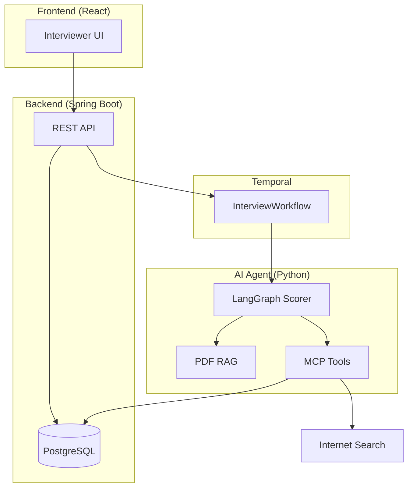

# HR Interview AI Agent

AI-assisted HR interview scoring for interviewers. Type what the interviewee says; the agent scores responses (A–F) using RAG from PDF Q&A guides, optional web search, and ChatGPT.

## Architecture

## Services

| Service | Stack | Role |
|---------|-------|------|
| `frontend/` | React + Vite | Interviewer types answers, sees grade & rationale |
| `backend/` | Java Spring Boot 3 | Sessions, persistence, Temporal workflow start |
| `ai-agent/` | Python, LangGraph, OpenAI | Scoring graph, RAG ingest, MCP tools, Temporal worker |

## Quick start (local)

1. Copy env templates and set `OPENAI_API_KEY`.
2. `docker compose up -d` — PostgreSQL, Temporal.
3. Start AI worker: `cd ai-agent && pip install -e . && python -m hr_interview_agent.worker`
4. Start backend: `cd backend && ./mvnw spring-boot:run`
5. Start frontend: `cd frontend && npm install && npm run dev`
6. Upload a PDF Q&A guide via UI or `POST /api/rag/documents`.

## Samsung Cloud Platform

Deploy manifests under `infra/scp/`. Build images with `infra/scripts/build-push.sh` (configure registry in `.env.scp`).

## Grade scale

| Grade | Meaning |
|-------|---------|
| A | Excellent — exceeds expectations |
| B | Good — meets expectations |
| C | Adequate — partial fit |
| D | Weak — significant gaps |
| F | Fail — does not meet criteria |

## License

Internal prototype — Samsung HR.
