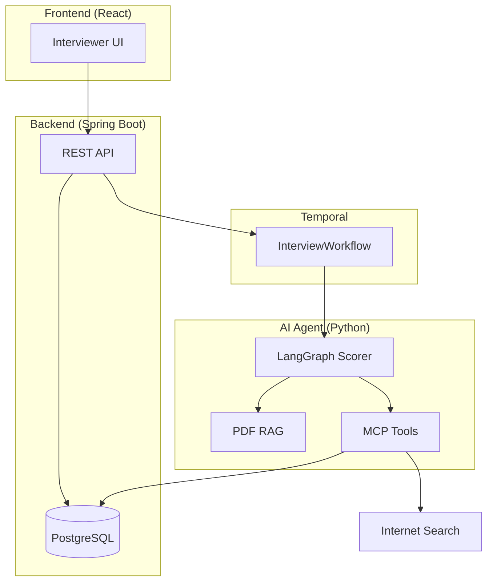

# HR Interview AI Agent

AI-assisted HR interview scoring for interviewers. Type what the interviewee says; the agent scores responses (A–F) using RAG from PDF Q&A guides, optional web search, and ChatGPT.

## Architecture



## Services

| Service | Stack | Role |
|---------|-------|------|
| `frontend/` | React + Vite | Interviewer types answers, sees grade & rationale |
| `backend/` | Java Spring Boot 3 | Sessions, persistence, Temporal workflow start |
| `ai-agent/` | Python, LangGraph, OpenAI | Scoring graph, RAG ingest, MCP tools, Temporal worker |

## Prerequisites

- **Docker** — PostgreSQL and Temporal (local infra)
- **Python 3.11+** — AI agent
- **Java 21** and **Maven** — backend
- **Node.js 20+** and **npm** — frontend
- **OpenAI API key** — set in `.env` (see below)

## Installing dependencies

There is no root `requirements.txt`. Each service declares its own dependencies:

| Service | Dependency file | Install command |
|---------|-----------------|-----------------|
| AI agent | `ai-agent/pyproject.toml` | `pip install -e .` (from `ai-agent/`) |
| Backend | `backend/pom.xml` | Maven resolves on build/run |
| Frontend | `frontend/package.json` | `npm install` (from `frontend/`) |

### 1. Environment

```powershell
copy .env.example .env
```

Edit `.env` and set at least `OPENAI_API_KEY`. Optional: `TAVILY_API_KEY` or `BRAVE_API_KEY` for web search.

### 2. Infra (PostgreSQL + Temporal)

```powershell
docker compose up -d
```

- Temporal UI: http://localhost:8088

### 3. AI agent (Python)

Uses `pyproject.toml` (same role as `requirements.txt`). There is no separate `requirements.txt` in this repo.

```powershell
cd ai-agent
python -m venv .venv
.\.venv\Scripts\Activate.ps1
pip install -e .
```

Optional dev tools (pytest, ruff):

```powershell
pip install -e ".[dev]"
```

To generate a frozen `requirements.txt` locally (optional):

```powershell
pip freeze > requirements.txt
```

### 4. Backend (Spring Boot)

```powershell
cd backend
mvn spring-boot:run
```

Maven downloads dependencies from `pom.xml` on first run. API: http://localhost:8080

### 5. Frontend (React)

```powershell
cd frontend
npm install
npm run dev
```

UI: http://localhost:5173 (Vite proxies `/api` to the backend)

## Quick start (run everything)

Open **three terminals** after completing [Installing dependencies](#installing-dependencies) above:

```powershell
# Terminal 1 — AI Temporal worker
cd ai-agent
.\.venv\Scripts\Activate.ps1
python -m hr_interview_agent.worker

# Terminal 2 — Backend
cd backend
mvn spring-boot:run

# Terminal 3 — Frontend
cd frontend
npm run dev
```

Then upload a PDF Q&A guide in the UI. A ready-made sample for **undergraduate business major** interviews is at `docs/sample-qa-guide-undergraduate-business.pdf` (see `docs/sample-qa-guide.md`). Or use `POST /api/rag/documents` with any PDF.

### Docker (all app services)

With infra already running (`docker compose up -d`):

```powershell
docker compose -f docker-compose.yml -f docker-compose.apps.yml up -d --build
```

Frontend: http://localhost — API: http://localhost:8080

## Samsung Cloud Platform

Deploy manifests under `infra/scp/`. Build images with `infra/scripts/build-push.sh` (configure registry in `.env.scp`).

## Grade scale

| Grade | Meaning |
|-------|---------|
| A | Excellent — exceeds expectations |
| B | Good — meets expectations |
| C | Adequate — partial fit |
| D | Weak — significant gaps |
| F | Fail — does not meet criteria |

## License

Internal prototype — Samsung HR.
