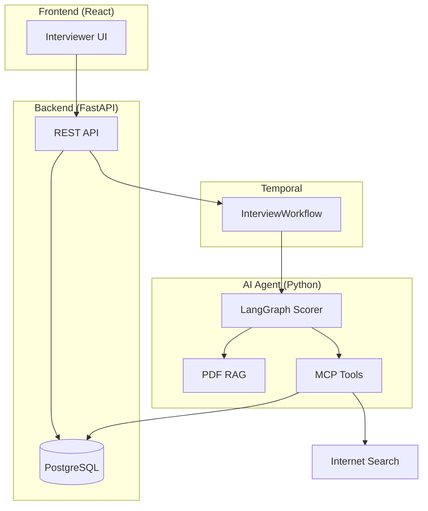
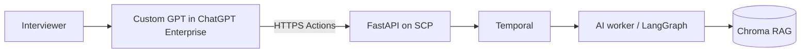

# HR Interview AI Agent

AI-assisted HR interview scoring for interviewers. Type what the interviewee says; the agent scores responses (A–F) using RAG from PDF Q&A guides, optional web search, and ChatGPT.

You can use the **built-in React UI** or **ChatGPT Enterprise** (Custom GPT + Actions) as the interviewer interface—see [Using ChatGPT Enterprise](#using-chatgpt-enterprise-custom-gpt--actions).

## Architecture



## Services

| Service | Stack | Role |
|---------|-------|------|
| `frontend/` | React + Vite | **Optional** — interviewer UI (skip if using ChatGPT Enterprise) |
| `backend/` | Python FastAPI | Sessions, persistence, Temporal workflow start |
| `ai-agent/` | Python, LangGraph, OpenAI | Scoring graph, RAG ingest, MCP tools, Temporal worker |

## Using ChatGPT Enterprise (Custom GPT + Actions)

Use **ChatGPT Enterprise** as the interviewer UI instead of the React app. Interviewers chat in ChatGPT; a **Custom GPT** calls your **FastAPI** backend via **GPT Actions**. Scoring still runs through **Temporal → LangGraph → RAG** on your infrastructure (the Custom GPT does not replace your agent).



### What you still run

| Component | Required? |
|-----------|-----------|
| PostgreSQL, Temporal, AI worker, FastAPI backend | Yes |
| `frontend/` React app | No |
| OpenAI API key in `.env` (for LangGraph scoring) | Yes |
| ChatGPT Enterprise workspace | Yes |

### Enterprise prerequisites

Work with your **ChatGPT Enterprise admin** to confirm:

1. **Custom GPTs** are enabled for your workspace.
2. **GPT Actions** (third-party API calls) are allowed by company policy.
3. The backend API is reachable from OpenAI’s Action servers (**public HTTPS** URL on SCP, or an approved enterprise connector pattern your org uses).
4. **Data handling** is approved: interview text is sent to ChatGPT for the conversation and to your API for scoring (and may be logged per your retention settings).

### Step 1 — Deploy the backend stack (no React required)

Deploy on SCP (or run locally with a tunnel for pilots):

```powershell
docker compose up -d
docker compose -f docker-compose.yml -f docker-compose.apps.yml up -d --build
```

Ensure these are healthy:

- FastAPI: `https://<your-api-host>/health` → `{"status":"ok"}`
- AI worker: `python -m hr_interview_agent.worker`
- OpenAPI schema: `https://<your-api-host>/openapi.json`

### Step 2 — Load the Q&A PDF into RAG (one-time per guide)

ChatGPT Actions are awkward for multipart PDF upload. **Ingest PDFs via API** before interviews:

```powershell
curl -X POST "https://<your-api-host>/api/rag/documents" `
  -F "file=@docs/sample-qa-guide-undergraduate-business.pdf"
```

Or use the React UI once for upload, then rely on ChatGPT only for scoring. Sample PDF: `docs/sample-qa-guide-undergraduate-business.pdf`.

### Step 3 — Create a Custom GPT in ChatGPT Enterprise

1. Sign in to your **ChatGPT Enterprise** workspace.
2. Go to **Explore GPTs** → **Create** (or **Create a GPT**).
3. **Configure** the GPT:

   **Name (example):** `HR Interview Scorer`

   **Instructions (example — paste and adjust):**

   ```text
   You assist HR interviewers who type what the candidate said during a live interview.

   Workflow:
   1. At the start of an interview, call createSession with interviewerName, candidateName, and optional roleTitle. Remember the returned session id for the whole chat.
   2. When the user provides the interviewee's answer (and optionally the question topic), call scoreTurn with that session id, intervieweeText, questionContext, and useWebSearch only if the user asks for web context.
   3. Reply with the letter grade (A–F) and the rationale in clear prose. Grades: A excellent, B good, C adequate, D weak, F fail.
   4. If the user asks for history, call listTurns for the current session.

   Do not invent grades; always use the API result. If no session exists yet, create one first.
   ```

   **Conversation starters (optional):**

   - `Start interview: interviewer [name], candidate [name], role [title]`
   - `Score this answer: [paste what the interviewee said]`

4. Under **Capabilities**, enable **Actions** (and disable features you do not need, e.g. DALL·E, if policy requires).

### Step 4 — Connect Actions to your API

1. In the GPT editor, open **Actions** → **Create new action**.
2. **Import** schema from URL:

   ```text
   https://<your-api-host>/openapi.json
   ```

3. If import is too large, paste a minimal schema (paths only):

   - `POST /api/sessions` — create session  
   - `GET /api/sessions/{session_id}` — get session  
   - `POST /api/sessions/{session_id}/score` — score answer  
   - `GET /api/sessions/{session_id}/turns` — list turns  

4. Set **Authentication** (choose what your security team approves):

   | Method | When to use |
   |--------|-------------|
   | **API Key** (header) | Simple pilot — e.g. header `X-Api-Key` (add validation on FastAPI when you harden prod) |
   | **OAuth** | Enterprise standard if your IdP exposes OAuth for the API gateway |
   | **None** | Dev only — never on production |

5. Set the **Server URL** to `https://<your-api-host>` (no trailing slash).

6. **Save** the GPT and set visibility to **Only people at [your company]** (typical for Enterprise).

### Step 5 — Publish and test

1. **Publish** the GPT to your workspace (admin may need to approve).
2. Open the GPT as an interviewer and run:

   - “Start interview: interviewer Kim, candidate Park, role Business Analyst intern”
   - “Question: Why did you choose a business major? Answer: I enjoyed our marketing case competition and led the pricing section…”

3. Confirm the GPT calls your API and returns a grade + rationale.

4. In **Temporal UI** (`http://localhost:8088` locally), verify `InterviewScoringWorkflow` runs.

### Example Action payloads (for debugging)

**Create session**

```json
POST /api/sessions
{
  "interviewerName": "Kim Lee",
  "candidateName": "Park Min",
  "roleTitle": "Undergraduate business major"
}
```

**Score answer**

```json
POST /api/sessions/{session_id}/score
{
  "intervieweeText": "I chose business because...",
  "questionContext": "Why did you choose an undergraduate business major?",
  "useWebSearch": false
}
```

### Limitations (ChatGPT UI vs React UI)

| Topic | ChatGPT Enterprise | React `frontend/` |
|--------|-------------------|-------------------|
| PDF upload to RAG | Use API or admin tool | Built-in upload button |
| Session UX | Managed via chat + GPT memory | Explicit session screen |
| Latency | Action round-trip + workflow | Same API, direct UI |
| Compliance | Chat + Action logs in OpenAI Enterprise | Only your stack |

### Optional: MCP instead of Actions

If your Enterprise plan supports **MCP connectors**, you can expose the same operations as MCP tools (see `ai-agent/mcp/servers/README.md`) instead of OpenAPI Actions. Actions above are usually faster to pilot.

More architecture detail: `docs/ARCHITECTURE.md`.

## Prerequisites

- **Docker** — PostgreSQL and Temporal (local infra)
- **Python 3.11+** — AI agent and backend
- **Node.js 20+** and **npm** — only if using the React frontend
- **ChatGPT Enterprise** workspace — only if using Custom GPT + Actions (see above)
- **OpenAI API key** — set in `.env` (see below)

## Installing dependencies

There is no root `requirements.txt`. Each service declares its own dependencies:

| Service | Dependency file | Install command |
|---------|-----------------|-----------------|
| AI agent | `ai-agent/pyproject.toml` | `pip install -e .` (from `ai-agent/`) |
| Backend | `backend/pyproject.toml` | `pip install -e .` (from `backend/`; needs ai-agent installed) |
| Frontend | `frontend/package.json` | `npm install` (from `frontend/`) |

### 1. Environment

```powershell
copy .env.example .env
```

Edit `.env` and set at least `OPENAI_API_KEY`. Optional: `TAVILY_API_KEY` or `BRAVE_API_KEY` for web search.

### 2. Infra (PostgreSQL + Temporal)

```powershell
docker compose up -d
```

- Temporal UI: http://localhost:8088

### 3. AI agent (Python)

Uses `pyproject.toml` (same role as `requirements.txt`). There is no separate `requirements.txt` in this repo.

```powershell
cd ai-agent
python -m venv .venv
.\.venv\Scripts\Activate.ps1
pip install -e .
```

Optional dev tools (pytest, ruff):

```powershell
pip install -e ".[dev]"
```

To generate a frozen `requirements.txt` locally (optional):

```powershell
pip freeze > requirements.txt
```

### 4. Backend (FastAPI)

Install the AI agent package first (backend starts Temporal workflows defined there):

```powershell
cd ai-agent
pip install -e .
cd ..\backend
pip install -e .
uvicorn hr_interview_backend.main:app --reload --port 8080
```

API: http://localhost:8080 — OpenAPI docs: http://localhost:8080/docs

### 5. Frontend (React) — optional

Skip this section if you use [ChatGPT Enterprise](#using-chatgpt-enterprise-custom-gpt--actions).

```powershell
cd frontend
npm install
npm run dev
```

UI: http://localhost:5173 (Vite proxies `/api` to the backend)

## Quick start (run everything)

### Option A — ChatGPT Enterprise (no React)

Open **two terminals** after [Installing dependencies](#installing-dependencies) §1–4:

```powershell
# Terminal 1 — AI Temporal worker
cd ai-agent
.\.venv\Scripts\Activate.ps1
python -m hr_interview_agent.worker

# Terminal 2 — Backend (public HTTPS for Actions, or tunnel for dev)
cd backend
uvicorn hr_interview_backend.main:app --host 0.0.0.0 --port 8080
```

Then follow [Using ChatGPT Enterprise](#using-chatgpt-enterprise-custom-gpt--actions).

### Option B — React UI

Open **three terminals** after completing [Installing dependencies](#installing-dependencies) above:

```powershell
# Terminal 1 — AI Temporal worker
cd ai-agent
.\.venv\Scripts\Activate.ps1
python -m hr_interview_agent.worker

# Terminal 2 — Backend (after pip install -e ai-agent and -e backend)
cd backend
uvicorn hr_interview_backend.main:app --reload --port 8080

# Terminal 3 — Frontend
cd frontend
npm run dev
```

Then upload a PDF Q&A guide in the UI or via API. Sample: `docs/sample-qa-guide-undergraduate-business.pdf` (see `docs/sample-qa-guide.md`).

### Docker (all app services)

With infra already running (`docker compose up -d`):

```powershell
docker compose -f docker-compose.yml -f docker-compose.apps.yml up -d --build
```

Frontend: http://localhost — API: http://localhost:8080

## Samsung Cloud Platform

Deploy manifests under `infra/scp/`. Build images with `infra/scripts/build-push.sh` (configure registry in `.env.scp`).

## Grade scale

| Grade | Meaning |
|-------|---------|
| A | Excellent — exceeds expectations |
| B | Good — meets expectations |
| C | Adequate — partial fit |
| D | Weak — significant gaps |
| F | Fail — does not meet criteria |

## License

Internal prototype — Samsung HR.
