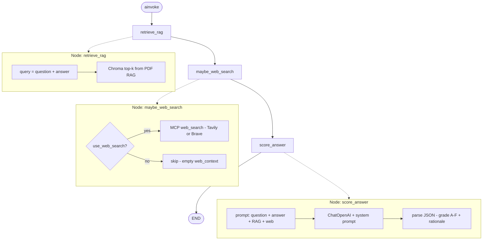
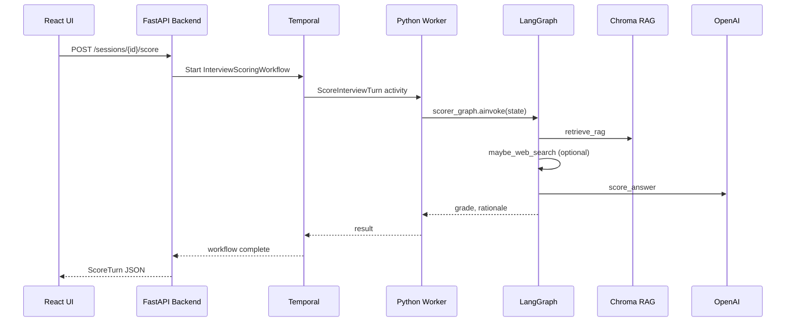

# HR Interview System — Architecture

## Request flow (score one answer)

1. Interviewer submits text in React UI.
2. FastAPI `POST /api/sessions/{id}/score` starts Temporal workflow `InterviewScoringWorkflow` via `temporalio` client.
3. Python worker executes LangGraph (see [LangGraph scorer flow](#langgraph-scorer-flow) below).
4. Backend saves `ScoreTurn` and returns grade to UI.

## LangGraph scorer flow

Defined in `ai-agent/src/hr_interview_agent/graph/scorer.py`. The graph is **linear** (no conditional edges); the web-search branch is handled **inside** the `maybe_web_search` node.

### State (`InterviewState`)

| Field | Set by | Purpose |
|-------|--------|---------|
| `session_id` | Input | Session identifier |
| `question_context` | Input | Interviewer’s question / topic |
| `interviewee_text` | Input | What the candidate said |
| `use_web_search` | Input | UI checkbox |
| `rag_context` | `retrieve_rag` | Retrieved PDF Q&A chunks |
| `web_context` | `maybe_web_search` | Search snippets or empty |
| `grade`, `rationale` | `score_answer` | Final output (A–F) |
| `messages` | `score_answer` | LangChain message history |

### End-to-end (with Temporal)

## Backend (FastAPI)

Code: `backend/src/hr_interview_backend/`

| Layer | Path | Role |
|-------|------|------|
| Routes | `routers/sessions.py`, `routers/rag.py` | REST API matching the React client |
| Services | `services/interview_service.py`, `services/rag_service.py` | Business logic + DB |
| Temporal | `temporal_service.py` | `execute_workflow` → AI worker activities |
| ORM | `models.py` + SQLAlchemy | PostgreSQL (`interview_sessions`, `score_turns`, `rag_documents`) |

Local run requires both packages installed: `pip install -e ai-agent` then `pip install -e backend`.

## Why Temporal?

- Retries and timeouts for LLM calls (minutes-long activities).
- Same workflow for PDF ingest (`IngestRagDocumentWorkflow`).
- Future: multi-step interviews, human-in-the-loop, scheduled reports.

## Why MCP?

Tools are isolated processes with standard protocols:

- Swap Brave ↔ Tavily without changing LangGraph.
- Postgres MCP for read-only history without embedding SQL in prompts.
- Filesystem MCP for secure PDF paths on SCP volumes.

Dev mode uses `ai-agent/src/hr_interview_agent/mcp/tools.py` with the same interfaces.

## RAG design

- Upload PDF via backend → stored on volume → Temporal activity chunks + embeds into Chroma.
- Each scoring turn retrieves top-k chunks conditioned on question + answer text.
- Use structured Q&A PDFs (clear headings) for best retrieval.

## Security notes (production)

- Authenticate interviewers (SSO / Samsung IAM).
- Encrypt secrets via SCP Secret Manager.
- Network policies: only backend ↔ Temporal ↔ worker; no public worker endpoint.
- Audit log all scores and prompts.
